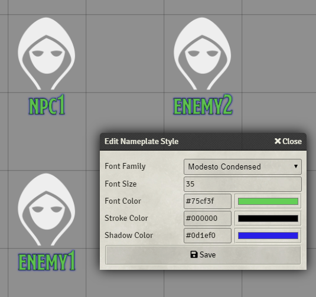

# Custom Nameplates

A module for FoundryVTT which allows you to customize token nameplates

## Instructions
In the module settings you can find the Edit Global Configuration button.
- This form dynamically updates, so you can see what changes are like in real time
- If you close this form, the changes will not be made and will revert back to the previous configuration

## Future

1. Token specific configurations (e.g enemies, friendlies)
2. Scene specific configurations?

Any issues feel free to ping me on Discord (@Erceron#0370)

## Contribution
If you'd like to support my work, feel free to leave a tip through [my paypal](http://paypal.me/cre463)
